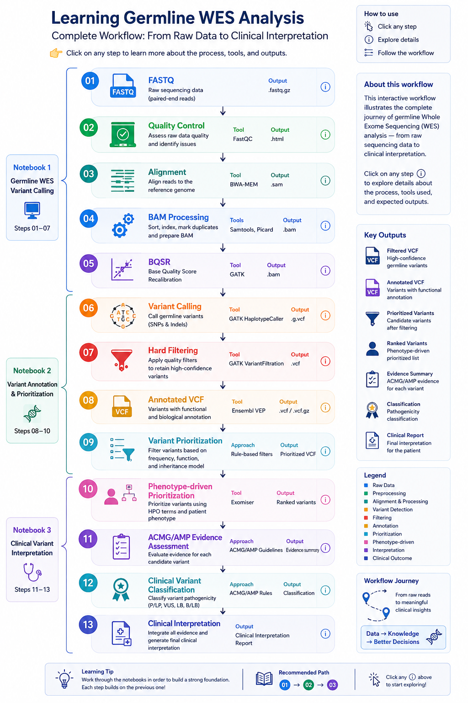

# Learning Germline Whole Exome Sequencing (WES)

A practical, step-by-step educational workflow for learning **germline Whole Exome Sequencing (WES) analysis**, from raw FASTQ files to clinical variant interpretation.

The project is designed as a **hands-on learning series** using Google Colab and commonly used bioinformatics tools. Each notebook builds on the previous one, gradually moving from sequencing quality control and variant calling to annotation, prioritization, and clinical interpretation.

> **Educational project:** This repository is intended for learning and training purposes. It is not intended for clinical diagnosis, medical decision-making, or use as a validated clinical pipeline.

## Table of Contents

- [Learning Path](#learning-path)
- [Notebooks](#notebooks)
- [How to Use](#how-to-use)
- [Tools](#tools)
- [Project Structure](#project-structure)
- [References](#references)
- [Author](#author)

## Learning Path

The notebooks are designed to build on each other and follow a complete conceptual workflow. The goal is not only to learn how to run the tools, but also to understand **why each step is performed and how its output is used in the next step.**

### Workflow Overview



## Notebooks

### 01 — Germline WES Variant Calling

#### FASTQ → Filtered VCF

The first notebook covers the main computational steps required to obtain germline variants from WES data.

#### You will learn
- Quality control
- Read alignment
- BAM processing
- BQSR
- Germline variant calling
- Variant filtering
- VCF inspection

**Output:** A filtered germline VCF.

#### Notebook 1:
[](
https://colab.research.google.com/github/Eman-Koosehlar/WES_Analysis_Tutorials/blob/master/Notebooks/01_Germline_WES_Variant_Calling.ipynb
)

### 02 — Germline Variant Annotation

#### Filtered VCF → Annotated/Prioritized VCF

The second notebook uses the filtered VCF from Notebook 1 and adds biological information using **Ensembl VEP**.

#### You will learn
- Variant annotation
- Gene and transcript consequences
- Population frequency
- Functional impact
- Variant filtering
- Initial variant prioritization

It also contains an optional workflow for preparing *simulated clinical cases* used in Notebook 3.

**Output: Annotated and filtered VCF files.**

#### Notebook 2:
[](https://colab.research.google.com/github/Eman-Koosehlar/WES_Analysis_Tutorials/blob/)


### 03 — Clinical Variant Interpretation

#### Annotated VCF → Clinical Interpretation

The third notebook moves from bioinformatics processing toward clinical reasoning.

#### You will learn
- Patient phenotype and HPO terms
- Phenotype-driven prioritization
- Exomiser
- Candidate variant review
- Gene–disease evaluation
- ACMG/AMP evidence
- Variant classification
- Clinical interpretation reporting

> The notebook will gradually include **additional clinical cases** to practice different interpretation scenarios.

#### Output: A structured clinical variant interpretation.

#### Notebook 3: 
[](https://colab.research.google.com/github/Eman-Koosehlar/WES_Analysis_Tutorials/blob/)


## How to Use

### Recommended

Follow the notebooks in order:

```{text}
Notebook 1
    ↓
Notebook 2
    ↓
Notebook 3
```

Whenever possible, use the output generated from the previous notebook as the input for the next one. This provides the most complete learning experience.

### Independent practice

Prepared example datasets may also be provided so that individual notebooks can be explored independently.

#### Google Colab

The notebooks are designed to run in Google Colab.

Before starting, check the **Requirements and Environment Setup** section inside each notebook for:

- Required software
- Reference genomes
- Databases
- Runtime requirements
- Input files

Large reference files and databases are not stored directly in this repository.

## Tools

The project introduces tools including:

- FastQC
- BWA
- Samtools
- GATK
- Ensembl VEP
- Exomiser
- Human Phenotype Ontology (HPO)

`The notebooks provide installation and usage instructions where needed.`


## Project Structure
``` {text}
WES_Analysis_Tutorials/
├── Notebooks 
│   ├── 01_Germline_WES_Variant_Calling.ipynb
│   ├── 02_Germline_Variant_Annotation.ipynb
│   └── 03_Clinical_Variant_Interpretation.ipynb
├── Figures
├── Data
├── Results
├── README.md
└── LICENSE/
```
> The project will be expanded with additional clinical cases and learning material over time.

## References

Key resources used throughout the project include:

- GATK Best Practices
- Ensembl Variant Effect Predictor (VEP)
- Exomiser
- Human Phenotype Ontology (HPO)
- ClinVar
- gnomAD
- ACMG/AMP variant interpretation guidelines

Detailed references are provided within the individual notebooks.

## Author

### Eman Koosehlar
Researcher interested in bioinformatics, genomic data analysis

- **[GitHub]https://github.com/Eman-Koosehlar/**
- **[LinkedIn](https://www.linkedin.com/in/eman-koosehlar-9a78b5175/)** 

If you find an error or have a suggestion, feel free to open an issue or discussion.


## Start Here

### New to the project?
- Start with Notebook 1: [](
https://colab.research.google.com/github/Eman-Koosehlar/WES_Analysis_Tutorials/blob/master/Notebooks/01_Germline_WES_Variant_Calling.ipynb
)

### Already familiar with variant calling?
- Go to Notebook 2: [](https://colab.research.google.com/github/Eman-Koosehlar/WES_Analysis_Tutorials/blob/)

### Interested in clinical interpretation?
- Go to Notebook 3: [](https://colab.research.google.com/github/Eman-Koosehlar/WES_Analysis_Tutorials/blob/)
